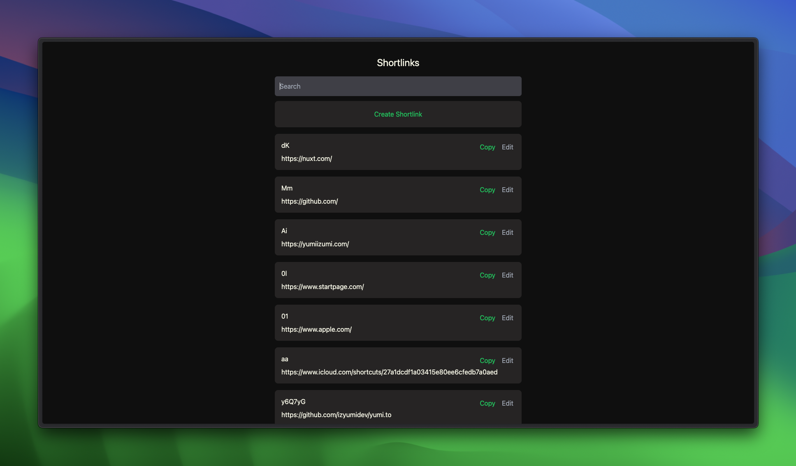

# yumi.to

Your personal URL shortener built with Nuxt, Supabase, Vercel, and TailwindCSS.



## Features

- 100% free (can be hosted at completely free with Vercel, Supabase, and GitHub)
  and open-source
- Create shortlinks via dashboard or an API call
- Shortlinks can be manually created or automatically generated
- Use your own domain name
- Authentication with GitHub or API key
- Support for various short-link dictionary
  - From Supabase Database
  - From JSON-based dictionary
- Preconfigured iOS Shortcuts

## Installation

### Requirements

There is no requirement to use this project, but the following are recommended:

- Domain name (e.g. `yumi.to`)

### Creating Supabase project

1. Create a new Supabase project
2. Add a new table called `shortlinks` with the following columns:
   - `id` (type: `uuid`, primary key)
   - `created_at` (type: `timestamptz`, default: `now()`)
   - `short` (type: `text`, unique)
   - `link` (type: `text`)
   - `expire` (type: `timestamptz`, default: `NULL`)

or you can use the following SQL query:

```sql
create table public.shortlinks (
  id uuid not null default gen_random_uuid (),
  created_at timestamp with time zone not null default now(),
  short text not null default ''::text,
  link text not null default ''::text,
  expire timestamp with time zone null,
  constraint shortlinks_pkey primary key (id),
  constraint shortlinks_short_key unique (short)
)
```

### Deploying

1. Fork this repository
2. Create a new Vercel project
3. Add the following environment variables:
   - `SUPABASE_URL` (your Supabase URL e.g.
     `https://<your-project>.supabase.co`)
   - `SUPABASE_KEY` (your Supabase public anon key)
   - `BASE_URL` (your domain name e.g. `https://yumi.to`)
4. Follow the instructions
   [here](https://vercel.com/docs/projects/domains/add-a-domain) to set up your
   custom domain.

### Authentication with GitHub

By default, this project uses GitHub as the authentication provider. You can
change this by editing `pages/dashboard.vue` and Supabase authentication
provider settings.

To continue with GitHub, follow the instructions
[here](https://supabase.com/docs/guides/auth/social-login/auth-github)

### Row-level security for Supabase

After setting up authentication, you can add row-level security to your Supabase
table to prevent unauthorized users from modifying your shortlinks.

1. Create an account for yourself in the dashboard of your fork of this project
   (e.g. `https://yumi.to/dashboard`)
2. Copy your user ID from the `users` table in Supabase
3. Add the following row-level security policies to your `shortlinks` table
   (replace `<your-user-id>` with your user ID from step 2):

```sql
-- Allow anyone to read shortlinks
create policy "Allow anyone to read shortlinks" on public.shortlinks for select using (true);

-- Allow yourself to create shortlinks
create policy "Allow yourself to create shortlinks" on public.shortlinks for insert with check (auth.uid() = '<your-user-id>');

-- Allow yourself to update shortlinks
create policy "Allow yourself to update shortlinks" on public.shortlinks for update using (auth.uid() = '<your-user-id>') with check (auth.uid() = '<your-user-id>');

-- Allow yourself to delete shortlinks
create policy "Allow yourself to delete shortlinks" on public.shortlinks for delete using (auth.uid() = '<your-user-id>');
```

4. Go into Auth Settings in Project Settings on Supabase dashboard to disable
   new user signups.

### Setting up Cron Job for Expiring Shortlinks

In Supabase SQL Editor, run the following query to set up a cron job to delete expired shortlinks every week on Sunday at 02:00 (for customizing cron, see [crontab.guru](https://crontab.guru/#0_2_*_*_0)):

```sql
select cron.schedule(
  'weekly-cleanup-of-expired-shortlinks',
  '0 2 * * 0', -- At 02:00 on Sunday.
  $$ delete from shortlinks where expire < now() - interval '1 week' $$
)
```

### Customizing

- Change `url` in `composables/useExternalRedirect.ts` to whatever you want
  default redirect to be (e.g. `https://yumiizumi.com`)
- Change `redirectTo` option in `pages/dashboard.vue` to
  `<your-domain>/dashboard` (e.g. `https://yumi.to/dashboard`)
- Change the `pages/blog` directory to whatever you want for specific directory
  name shortlinks (e.g. `pages/blog` -> `pages/abc` to support links like
  `yumi.to/abc/xyz`)
- This project uses TailwindCSS for styling, so you can customize the styles by
  editing the component classes

### Using with iOS Shortcuts

You can use this project with iOS Shortcuts to create a custom URL shortener. To
do this, you can use the following shortcut:

1. Create an API key
   1. Create a random string as the API key
   2. Take the MD5 hash of the API key
   3. Store the MD5 hash of the API key as `API_KEY_HASH` in your Supabase Edge
      Function Secrets Management settings
2. Get the iOS shortcut [here](https://yumi.to/aa)
3. First time you run the shortcut, you will be prompted to enter your domain
   name (e.g. `yumi.to`) and the API key you created in step 1
4. You are now ready to use the shortcut!

## License

This project is licensed under the MIT License - see the [LICENSE](LICENSE) file
for details.

## Acknowledgements

- [Supabase](https://supabase.io)
- [Vercel](https://vercel.com)
- [Nuxt](https://nuxtjs.org)
- [TailwindCSS](https://tailwindcss.com)
- [Create a Scalable URL Shortener App Using Nuxt 3, Supabase, and TainwilndCSS](https://youtube.com/watch?v=A3OO1ZVLRjA)
